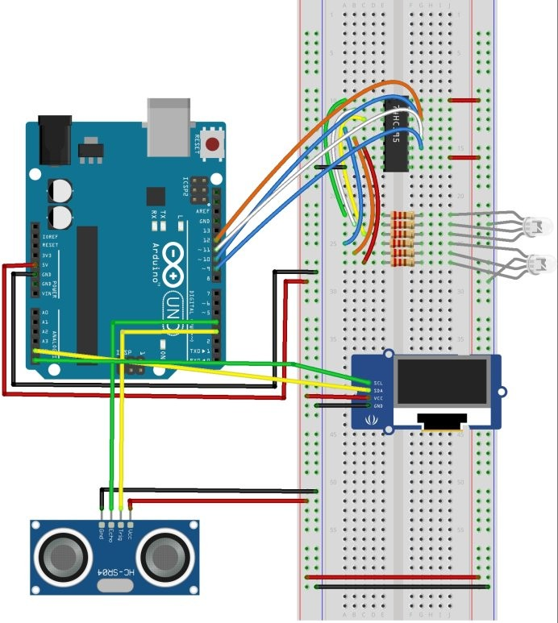

This is my project!

- [Game Rules](#game-rules)
- [Setup](#setup)
  - [Components](#components)
  - [Wiring](#wiring)
- [Code](#code)
  - [Main sketch](#main-sketch)
  - [Settings](#settings)
  - [Display](#display)
  - [Gameplay](#gameplay)
  - [Lights](#lights)
  - [Sonar](#sonar)
  - [World](#world)

# Game Rules
The player holds his hand over the sensor for a few seconds and that starts the game. Two RGB (Red, Green, Blue) LEDs start flashing in different colors. At a random time they will stop flashing and will remain lit, with the same color (e.g. both would become Blue). The player has to react as quick as possible and move his hand away from the sensor. The reaction time is recorded. The game is keeping track of the best reaction time so far. If the player moves their hand away from the sensor, before the signal is set off (i.e. before the LEDs stop flashing and remain the same color), that's considered a "bad" attempt.

# Setup
## Components
- Ultrasonic sensor HC-SR04
- 220 ohm resistors
- Two RGB LEDs
- [IIC 0.91" OLED Display](https://www.amazon.com/gp/product/B07D9H83R4)
- Some wires
- Breadboard
- Arduino Uno r3

## Wiring

